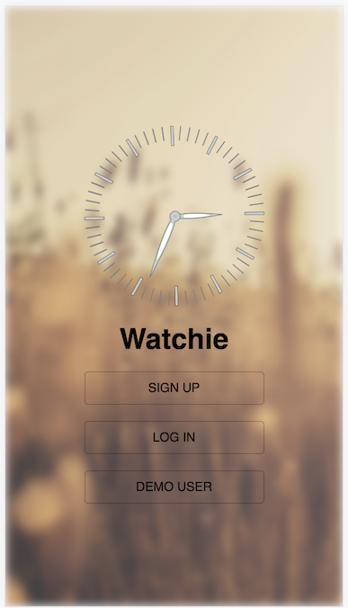
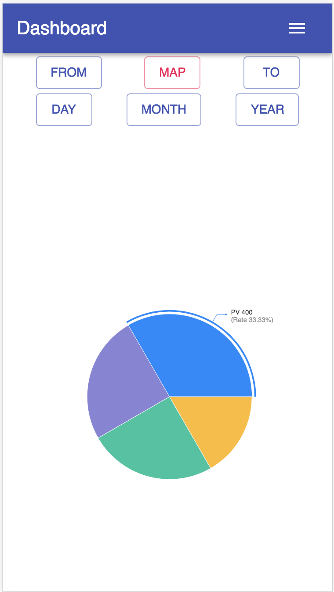
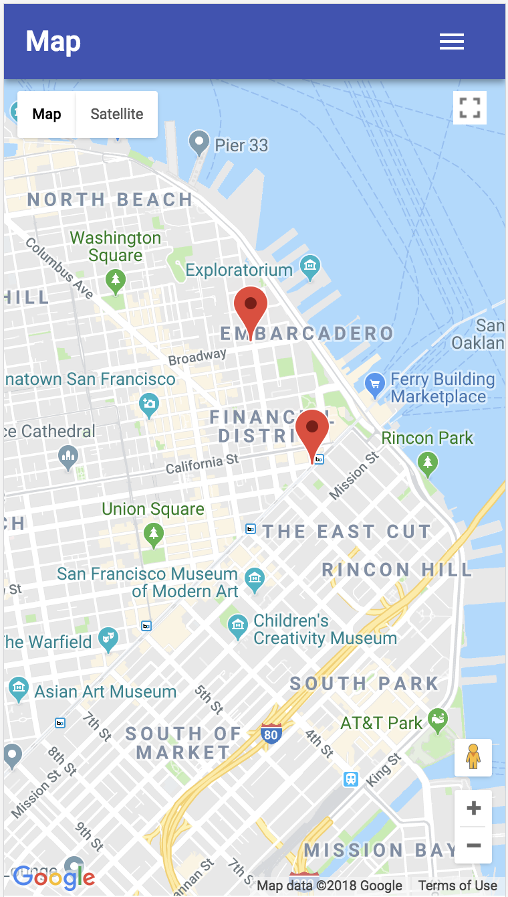
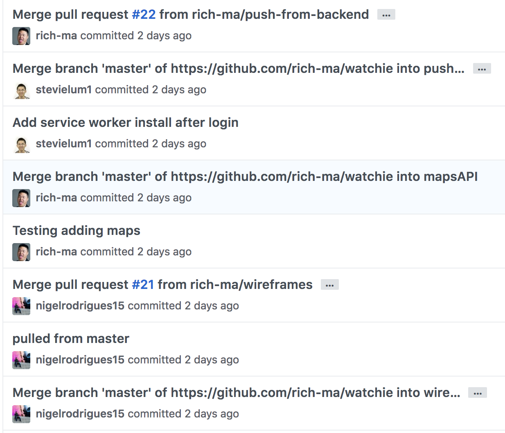
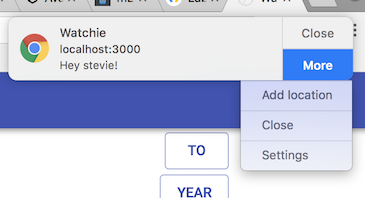

# Watchie

## Group Members
**Steven Lum, Richard Ma, Nigel Rodrigues**
 
## Background and Overview
Watchie is a mobile application that will provide users with information about their time management. Every 30 minutes, users will receive push notifications asking for their current or nearby location. At any point, users can view a dashboard displaying information about how they have been spending their time.


| Splash | Dashboard | Map |
| ------ | --------- | --- |
|  |  |  |

## Technologies
- MERN Stack
- Notifications, Push, and Service Worker APIs
- Google Maps API
- Material UI
- Recharts.js

## Technical Challenges
Getting used to the MERN stack was a challenge in itself. We were all used to Rails and its magic. Node has no magic. We had to write our own routes. NoSQL with MongoDB was very different than Postgres. The user authentication workflow using JSON web tokens and `BCrypt` as well as frontend authentication with our React entry file was a lot more involved than simply having a `session_token` in our `users` table. There were a lot of `require` statements in every file, there were two `node_modules` folders, and two servers were running at the same time.


```javascript
// /routes/api/session.js

//login
router.post('/', (req, res) => {
  const { errors, isValid } = validateLoginInput(req.body);

  if (!isValid) {
    return res.status(400).json(errors);
  }

  const email = req.body.email;
  const password = req.body.password;
  User.findOne({ email })
    .then(user => {
       if (!user) {
         // Use the validations to send the error
         errors.email = 'User not found';
         return res.status(404).json(errors);
      }
      bcrypt.compare(password, user.passwordDigest)
        .then(isMatch => {
          if (isMatch) {
            const payload = { id: user.id, fname: user.fname };

            jsonwebtoken.sign(
              payload,
              keys.secretOrKey,
              // Tell the key to expire in one hour
              { expiresIn: 3600 },
              (err, token) => {
                res.json({
                  success: true,
                  token: 'Bearer ' + token
                });
              });
          } else {
            errors.password = 'Incorrect password';
            return res.status(400).json(errors);
          }
        });
    });
});
```

We were all inexperienced using the feature branch GitHub workflow. There was a lot of overhead figuring out who was working on what, and we tried to avoid merge conflicts as much as possible by not touching any part of what our teammates were working on. Due to our time constraints, we were not able to throughly have code reviews when merging branches.



Implementing push notifications was another challenge. We needed to understand how service workers worked. We needed a subscription object for each user, which will change over time, and we also do not want to send notifications all the time (either when they log out or at night).

```javascript
// app.js

// Send notifications to each user with a subscription object every minute if it is between 8AM and 8PM (for testing purposes)
setInterval(() => {
  const date = new Date();
  if (date.getHours() <= 20 && date.getHours() >= 8) {
    User.find()
      .then(users => {
        users.forEach(user => {
          if (user.subscription) {
            const subscription = JSON.parse(user.subscription);
            
            const payload = JSON.stringify({
              title: "Watchie",
              fname: user.fname
            });
          
            webpush.sendNotification(subscription, payload)
              .catch(err => {
                console.log(err);
              });
          }
        });
      });
      console.log("Sent notifications on", date.toString());
  }
}, 60000);
```

Our service worker responds to these push messages from our server with the following code:
```javascript
// /frontend/public/sw.js
self.addEventListener('push', e => {
  const data = e.data.json();
  self.registration.showNotification(data.title, {
    body: `Hey ${data.fname}!`,
    actions: [
      {action: 'addLocation', title: 'Add location'},
      {action: 'close', title: 'Close'},
    ]
  });
});
```

The notification looks like this:



###  Future Plans
- [ ] Show a heatmap of user’s locations